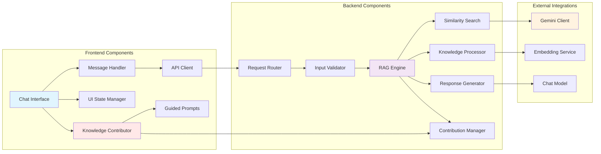

# RAG Customer Support Bot - Technical Design

## System Architecture

### High-Level Architecture

```mermaid
graph TB
    subgraph "Client Layer"
        UI[Web Interface<br/>HTML/CSS/JS]
        UX[User Experience<br/>Chat Interface]
    end
    
    subgraph "Vercel Platform"
        subgraph "Static Assets"
            HTML[index.html]
            CSS[style.css]
            JS[script.js]
        end
        
        subgraph "Serverless Functions"
            API[/api/chat.js<br/>Request Handler]
            RAG[RAG Engine<br/>Retrieval & Generation]
        end
    end
    
    subgraph "External Services"
        GEMINI[Google Gemini API<br/>LLM & Embeddings]
    end
    
    subgraph "Data Layer"
        KB[Knowledge Base<br/>knowledge_base.txt]
        CACHE[In-Memory Cache<br/>Embeddings & Chunks]
        CONTRIB[User Contributions<br/>Dynamic Knowledge]
    end
    
    UI --> API
    API --> RAG
    RAG --> GEMINI
    RAG --> KB
    RAG --> CACHE
    RAG --> CONTRIB
    UI --> CONTRIB
    
    style UI fill:#e1f5fe
    style API fill:#f3e5f5
    style RAG fill:#f3e5f5
    style GEMINI fill:#fff3e0
    style KB fill:#e8f5e8
    style CACHE fill:#e8f5e8
    style CONTRIB fill:#ffe8e8
```

### Component Architecture



## Data Models & Interfaces

### API Interfaces

#### Chat Request Interface
```typescript
interface ChatRequest {
  message: string;           // User's input message (max 1000 chars)
  sessionId?: string;        // Optional session identifier
  timestamp?: number;        // Request timestamp
}
```

#### Chat Response Interface
```typescript
interface ChatResponse {
  response: string;          // Bot's generated response
  confidence: number;        // Confidence score (0-1)
  sources?: string[];        // Referenced knowledge base sources
  timestamp: number;         // Response timestamp
  processingTime: number;    // Response generation time in ms
  contributionPrompt?: {     // Optional prompt for knowledge contribution
    show: boolean;           // Whether to show contribution UI
    message: string;         // Message encouraging contribution
    suggestedPrompts?: GuidedPrompt[]; // Pre-defined prompts to show
  };
}
```

#### Error Response Interface
```typescript
interface ErrorResponse {
  error: string;             // User-friendly error message
  code: string;              // Error code for debugging
  timestamp: number;         // Error timestamp
  requestId?: string;        // Request identifier for tracking
}
```

### Knowledge Base Models

#### Knowledge Chunk Interface
```typescript
interface KnowledgeChunk {
  id: string;                // Unique chunk identifier
  text: string;              // Chunk content
  embedding: number[];       // Vector embedding (768 dimensions)
  metadata: {
    source: string;          // Source identifier
    category?: string;       // Content category
    lastUpdated: number;     // Last update timestamp
  };
}
```

#### Knowledge Base Interface
```typescript
interface KnowledgeBase {
  chunks: KnowledgeChunk[];  // Array of knowledge chunks
  embeddings: number[][];    // Precomputed embeddings matrix
  metadata: {
    totalChunks: number;     // Total number of chunks
    lastProcessed: number;   // Last processing timestamp
    version: string;         // Knowledge base version
  };
}
```

### Similarity Search Models

#### Search Result Interface
```typescript
interface SearchResult {
  chunk: KnowledgeChunk;     // Matching knowledge chunk
  similarity: number;        // Cosine similarity score (0-1)
  relevance: number;         // Relevance score (0-1)
}
```

#### Search Query Interface
```typescript
interface SearchQuery {
  embedding: number[];       // Query embedding vector
  topK: number;              // Number of results to return
  threshold: number;         // Minimum similarity threshold
}
```

### Knowledge Contribution Models

#### Contribution Request Interface
```typescript
interface ContributionRequest {
  question: string;          // Question being asked
  answer: string;            // User-provided answer
  category?: string;         // Optional category
  source: 'user' | 'admin';  // Source of contribution
  confidence: number;        // User confidence in answer (1-5)
}
```

#### Guided Prompt Interface
```typescript
interface GuidedPrompt {
  id: string;                // Unique prompt identifier
  question: string;          // Question to ask user
  category: string;          // Knowledge category
  placeholder: string;       // Input placeholder text
  required: boolean;         // Whether answer is required
  validation?: {             // Optional validation rules
    minLength?: number;
    maxLength?: number;
    pattern?: string;
  };
}
```

#### Contribution Response Interface
```typescript
interface ContributionResponse {
  success: boolean;          // Whether contribution was accepted
  message: string;           // Feedback message to user
  suggestedPrompts?: GuidedPrompt[]; // Follow-up questions
  relatedTopics?: string[];  // Suggested related topics
}
```

## Detailed Component Specifications

### 1. Frontend Components

#### Chat Interface Component
**Responsibilities:**
- Render chat messages in chronological order
- Handle user input and form submission
- Display loading states and error messages
- Maintain responsive layout across devices

**Key Features:**
- Auto-scrolling to latest messages
- Message timestamp display
- Typing indicators
- Error state handling

#### Message Handler Component
**Responsibilities:**
- Validate user input before sending
- Format messages for display
- Handle special characters and markdown
- Manage message state and history

**Key Features:**
- Input sanitization
- Message formatting
- Character limit enforcement
- Enter key submission

#### API Client Component
**Responsibilities:**
- Make HTTP requests to backend API
- Handle request/response serialization
- Implement retry logic for failed requests
- Manage request timeouts

**Key Features:**
- Fetch API integration
- Error handling and retries
- Request timeout management
- Response validation

#### Knowledge Contributor Component
**Responsibilities:**
- Detect when bot has low confidence responses
- Present contribution opportunities to users
- Handle user-submitted knowledge contributions
- Validate and format contribution data

**Key Features:**
- Confidence threshold detection
- Contribution form management
- Real-time validation
- Progress feedback to users

#### Guided Prompts Component
**Responsibilities:**
- Present structured questions to gather specific knowledge
- Provide contextual help and examples
- Guide users through knowledge contribution process
- Suggest related topics and follow-up questions

**Key Features:**
- Pre-defined prompt categories:
  - Business Information (hours, contact, location)
  - Product/Service Details (features, pricing, availability)
  - Support Processes (how-to guides, troubleshooting)
  - Company Policies (returns, warranties, terms)
- Dynamic prompt generation based on existing knowledge gaps
- Progressive disclosure of advanced options
- Smart suggestions for related content

### 2. Backend Components

#### Request Router
**Responsibilities:**
- Route incoming HTTP requests
- Handle CORS and security headers
- Validate request methods and content types
- Initialize request context

**Implementation:**
```javascript
async function handleRequest(req, res) {
  // Set CORS headers
  res.setHeader('Access-Control-Allow-Origin', '*');
  res.setHeader('Access-Control-Allow-Methods', 'POST');
  res.setHeader('Access-Control-Allow-Headers', 'Content-Type');
  
  if (req.method === 'OPTIONS') {
    return res.status(200).end();
  }
  
  if (req.method !== 'POST') {
    return res.status(405).json({ error: 'Method not allowed' });
  }
  
  // Process request
  await processchatRequest(req, res);
}
```

#### RAG Engine
**Responsibilities:**
- Orchestrate the retrieval-augmented generation process
- Manage knowledge base initialization and caching
- Coordinate embedding generation and similarity search
- Generate contextual responses using retrieved information

**Core Algorithm:**
1. Initialize knowledge base embeddings (on cold start)
2. Generate embedding for user query
3. Perform similarity search against knowledge base
4. Retrieve top-K most relevant chunks
5. Construct prompt with retrieved context
6. Generate response using Gemini API
7. Format and return response

#### Knowledge Processor
**Responsibilities:**
- Parse and chunk knowledge base text
- Generate embeddings for knowledge chunks
- Cache processed embeddings in memory
- Handle knowledge base updates

**Processing Pipeline:**
```javascript
async function processKnowledgeBase(knowledgeText) {
  // 1. Split text into chunks
  const chunks = splitIntoChunks(knowledgeText);
  
  // 2. Generate embeddings for each chunk
  const embeddings = await generateEmbeddings(chunks);
  
  // 3. Create knowledge base structure
  const knowledgeBase = {
    chunks: chunks.map((text, index) => ({
      id: generateId(),
      text,
      embedding: embeddings[index],
      metadata: {
        source: 'knowledge_base.txt',
        lastUpdated: Date.now()
      }
    }))
  };
  
  return knowledgeBase;
}
```

#### Similarity Search Engine
**Responsibilities:**
- Implement cosine similarity calculation
- Perform efficient vector search
- Rank results by relevance
- Apply similarity thresholds

**Core Implementation:**
```javascript
function cosineSimilarity(vectorA, vectorB) {
  const dotProduct = vectorA.reduce((sum, a, i) => sum + a * vectorB[i], 0);
  const magnitudeA = Math.sqrt(vectorA.reduce((sum, a) => sum + a * a, 0));
  const magnitudeB = Math.sqrt(vectorB.reduce((sum, b) => sum + b * b, 0));
  return dotProduct / (magnitudeA * magnitudeB);
}

function searchSimilarChunks(queryEmbedding, knowledgeBase, topK = 5) {
  const similarities = knowledgeBase.chunks.map(chunk => ({
    chunk,
    similarity: cosineSimilarity(queryEmbedding, chunk.embedding)
  }));
  
  return similarities
    .sort((a, b) => b.similarity - a.similarity)
    .slice(0, topK)
    .filter(result => result.similarity > 0.3);
}
```

#### Response Generator
**Responsibilities:**
- Construct prompts with retrieved context
- Interface with Gemini API for response generation
- Format and post-process generated responses
- Handle generation errors and fallbacks

**Prompt Template:**
```javascript
function constructPrompt(userQuery, retrievedChunks) {
  const context = retrievedChunks
    .map(result => `- ${result.chunk.text}`)
    .join('\n');
    
  return `You are a helpful customer support assistant. Based ONLY on the following information, answer the user's question. If the information isn't relevant or doesn't contain the answer, say you don't have that information and suggest contacting support directly.

Context:
${context}

User Question: ${userQuery}

Please provide a helpful, conversational response based on the context above.`;
}
```

#### Contribution Manager
**Responsibilities:**
- Process user knowledge contributions
- Validate contribution quality and format
- Generate embeddings for new contributions
- Manage dynamic knowledge base updates
- Provide guided prompts for knowledge collection

**Core Implementation:**
```javascript
class ContributionManager {
  constructor(geminiClient, knowledgeBase) {
    this.gemini = geminiClient;
    this.kb = knowledgeBase;
    this.guidedPrompts = this.initializeGuidedPrompts();
  }

  async processContribution(contributionRequest) {
    // 1. Validate contribution
    const validation = await this.validateContribution(contributionRequest);
    if (!validation.valid) {
      return { success: false, message: validation.message };
    }

    // 2. Generate embedding for new knowledge
    const embedding = await this.generateEmbedding(contributionRequest.answer);

    // 3. Create knowledge chunk
    const chunk = {
      id: this.generateId(),
      text: `${contributionRequest.question}\n${contributionRequest.answer}`,
      embedding,
      metadata: {
        source: contributionRequest.source,
        category: contributionRequest.category,
        confidence: contributionRequest.confidence,
        lastUpdated: Date.now()
      }
    };

    // 4. Add to knowledge base
    this.kb.chunks.push(chunk);

    // 5. Suggest follow-up prompts
    const suggestedPrompts = await this.generateFollowUpPrompts(contributionRequest);

    return {
      success: true,
      message: 'Thank you! Your knowledge has been added.',
      suggestedPrompts,
      relatedTopics: this.findRelatedTopics(contributionRequest.category)
    };
  }

  initializeGuidedPrompts() {
    return [
      {
        id: 'business-hours',
        question: 'What are your business hours?',
        category: 'business-info',
        placeholder: 'e.g., Monday-Friday 9 AM to 5 PM',
        required: true
      },
      {
        id: 'contact-info',
        question: 'How can customers contact support?',
        category: 'business-info',
        placeholder: 'e.g., Email: support@company.com, Phone: (555) 123-4567',
        required: true
      },
      {
        id: 'main-products',
        question: 'What are your main products or services?',
        category: 'products',
        placeholder: 'Describe your key offerings',
        required: true
      },
      {
        id: 'pricing-info',
        question: 'What is your pricing structure?',
        category: 'pricing',
        placeholder: 'Basic plan $X/month, Pro plan $Y/month, etc.',
        required: false
      },
      {
        id: 'return-policy',
        question: 'What is your return/refund policy?',
        category: 'policies',
        placeholder: '30-day money back guarantee, etc.',
        required: false
      }
    ];
  }

  async shouldPromptForContribution(userQuery, confidence) {
    // Prompt for contribution if confidence is low and query seems legitimate
    return confidence < 0.3 && userQuery.length > 10 && !this.isSpam(userQuery);
  }
}
```

## Security Framework

### Input Validation & Sanitization
- **Message Length:** Limit user messages to 1000 characters
- **Content Filtering:** Remove potentially harmful content
- **SQL Injection:** Use parameterized queries (if database added)
- **XSS Prevention:** Sanitize all user inputs and outputs

### API Security
- **Rate Limiting:** Implement request throttling per IP
- **CORS Configuration:** Restrict cross-origin requests appropriately
- **Error Handling:** Never expose sensitive information in errors
- **API Key Security:** Store Gemini API key in environment variables

### Data Protection
- **HTTPS Only:** Enforce encrypted connections
- **No Persistent Storage:** Don't store user conversations
- **Memory Management:** Clear sensitive data from memory
- **Logging Security:** Avoid logging sensitive information

## Performance Optimization

### Caching Strategy
- **Embedding Cache:** Store knowledge base embeddings in memory
- **Response Cache:** Cache common responses (optional)
- **Static Assets:** Leverage Vercel's CDN for frontend assets

### Memory Management
- **Efficient Data Structures:** Use typed arrays for embeddings
- **Garbage Collection:** Explicit cleanup of large objects
- **Memory Monitoring:** Track memory usage patterns

### API Optimization
- **Batch Processing:** Process multiple embeddings efficiently
- **Connection Reuse:** Reuse HTTP connections to Gemini API
- **Timeout Handling:** Implement appropriate request timeouts

## Error Handling Strategy

### Error Categories
1. **User Input Errors:** Invalid or malformed requests
2. **API Errors:** Gemini API failures or rate limits
3. **System Errors:** Memory, network, or processing failures
4. **Knowledge Base Errors:** Missing or corrupted knowledge base

### Error Response Strategy
```javascript
class ErrorHandler {
  static handleError(error, context) {
    const errorResponse = {
      timestamp: Date.now(),
      requestId: context.requestId
    };
    
    switch (error.type) {
      case 'USER_INPUT_ERROR':
        return {
          ...errorResponse,
          error: 'Please check your message and try again.',
          code: 'INVALID_INPUT'
        };
        
      case 'API_ERROR':
        return {
          ...errorResponse,
          error: 'I\'m having trouble processing your request. Please try again in a moment.',
          code: 'SERVICE_UNAVAILABLE'
        };
        
      case 'RATE_LIMIT_ERROR':
        return {
          ...errorResponse,
          error: 'Too many requests. Please wait a moment and try again.',
          code: 'RATE_LIMITED'
        };
        
      default:
        return {
          ...errorResponse,
          error: 'Something went wrong. Please try again.',
          code: 'INTERNAL_ERROR'
        };
    }
  }
}
```

## Deployment Configuration

### Vercel Configuration
```json
{
  "version": 2,
  "functions": {
    "api/chat.js": {
      "memory": 1024,
      "maxDuration": 15
    }
  },
  "routes": [
    {
      "src": "/api/chat",
      "dest": "/api/chat.js"
    },
    {
      "src": "/(.*)",
      "dest": "/public/$1"
    }
  ],
  "env": {
    "NODE_ENV": "production"
  }
}
```

### Environment Variables
- `GEMINI_API_KEY`: Google Gemini API key
- `NODE_ENV`: Environment identifier
- `LOG_LEVEL`: Logging verbosity level

## Monitoring & Observability

### Metrics Collection
- **Response Times:** Track API response latencies
- **Error Rates:** Monitor error frequency and types
- **Usage Patterns:** Track request volumes and patterns
- **Cost Monitoring:** Monitor Gemini API usage and costs

### Logging Strategy
- **Structured Logging:** Use JSON format for logs
- **Log Levels:** Implement appropriate log levels (error, warn, info, debug)
- **No Sensitive Data:** Never log user messages or API keys
- **Request Tracing:** Track requests with unique identifiers

## Testing Strategy

### Unit Testing
- **Pure Functions:** Test similarity calculations, text processing
- **Mocking:** Mock external API calls for testing
- **Edge Cases:** Test error conditions and boundary cases

### Integration Testing
- **API Endpoints:** Test full request/response cycles
- **External Dependencies:** Test Gemini API integration
- **Error Handling:** Test various failure scenarios

### Performance Testing
- **Load Testing:** Test concurrent user scenarios
- **Memory Testing:** Monitor memory usage under load
- **Latency Testing:** Measure response times

---
*Design Version: 1.0*  
*Last Updated: 2025-08-03*  
*Next Review: Before implementation phase*