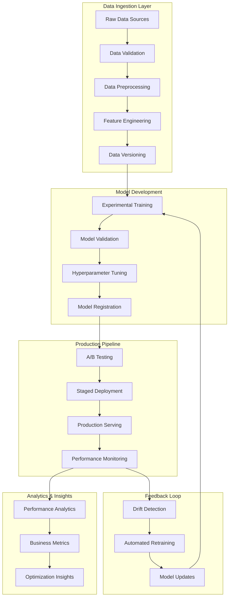
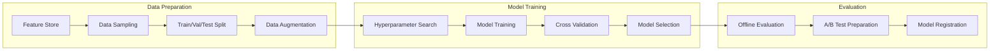
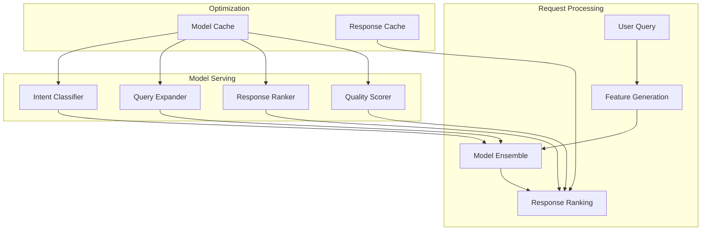
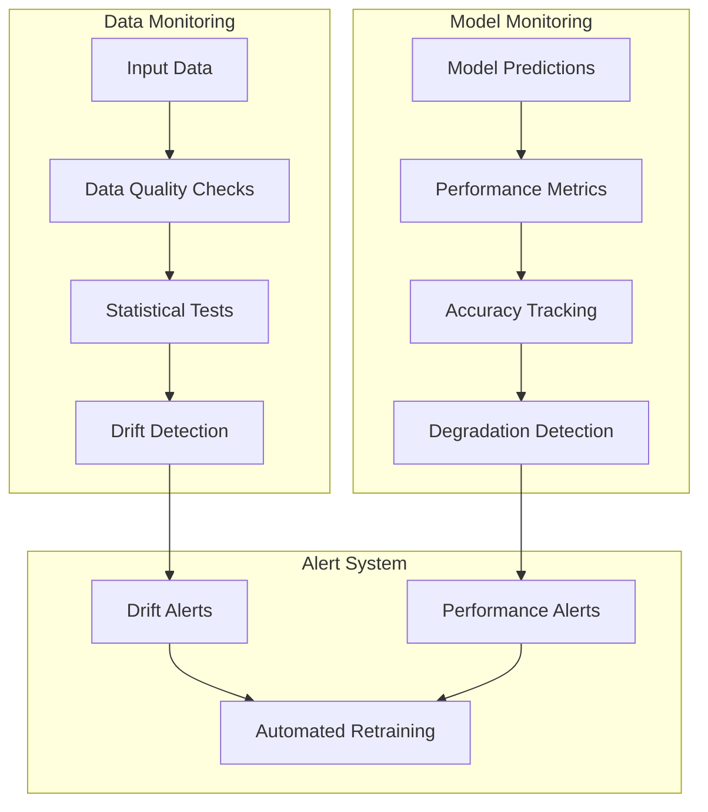
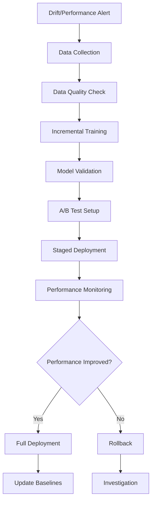

# Advanced ML Pipeline Design for RagZzy

## Overview

This document details the machine learning pipeline architecture for RagZzy's transformation into an intelligent conversational AI system. The pipeline encompasses data ingestion, model training, real-time inference, monitoring, and automated retraining capabilities.

## ML Pipeline Architecture

### High-Level ML Pipeline Flow



## 1. Data Pipeline Architecture

### Data Sources and Ingestion

```python
class MLDataPipeline:
    def __init__(self):
        self.data_sources = {
            'conversations': ConversationDataSource(),
            'user_feedback': FeedbackDataSource(),
            'knowledge_base': KnowledgeBaseSource(),
            'external_apis': ExternalDataSource()
        }
        self.validators = DataValidationSuite()
        self.feature_store = FeatureStore()
    
    async def ingest_data(self, source_type: str, data_config: dict):
        # Data ingestion with validation
        source = self.data_sources[source_type]
        raw_data = await source.extract(data_config)
        
        # Data quality validation
        validation_results = self.validators.validate(raw_data)
        if not validation_results.is_valid:
            raise DataQualityException(validation_results.errors)
        
        # Feature engineering and transformation
        features = await self.transform_data(raw_data)
        
        # Store in feature store with versioning
        await self.feature_store.store_features(
            features, version=data_config.get('version')
        )
        
        return features
```

### Feature Engineering Pipeline

**Conversation Features:**
- Message embeddings (dense features)
- Conversation length and turn counts
- Response time patterns
- User engagement metrics
- Intent classification probabilities

**User Behavior Features:**
- Query patterns and frequency
- Session duration and depth
- Feedback patterns (implicit/explicit)
- Topic preferences and expertise
- Temporal interaction patterns

**Knowledge Base Features:**
- Document relevance scores
- Content freshness metrics
- Usage frequency and effectiveness
- Topic coverage and gaps
- Quality indicators and user ratings

### Real-Time Feature Engineering

```python
class RealTimeFeatureEngine:
    def __init__(self):
        self.embedding_service = EmbeddingService()
        self.user_profiler = UserProfiler()
        self.conversation_tracker = ConversationTracker()
        self.cache = FeatureCache()
    
    async def generate_features(self, request_context):
        features = {}
        
        # Query-based features
        features['query_embedding'] = await self.embedding_service.embed(
            request_context.query
        )
        features['query_length'] = len(request_context.query.split())
        features['query_complexity'] = self.calculate_complexity(
            request_context.query
        )
        
        # User context features
        user_profile = await self.user_profiler.get_profile(
            request_context.user_id
        )
        features.update(user_profile.to_features())
        
        # Conversation context features
        conversation_state = self.conversation_tracker.get_state(
            request_context.session_id
        )
        features.update(conversation_state.to_features())
        
        # Cache frequently used features
        await self.cache.store(request_context.cache_key, features)
        
        return features
```

## 2. Model Training Pipeline

### Training Architecture



### Multi-Model Training System

```python
class MLModelTrainer:
    def __init__(self):
        self.hyperparameter_tuner = HyperparameterTuner()
        self.model_registry = ModelRegistry()
        self.evaluator = ModelEvaluator()
        self.experiment_tracker = ExperimentTracker()
    
    async def train_models(self, training_config):
        models_to_train = {
            'intent_classifier': IntentClassifierTrainer(),
            'response_ranker': ResponseRankerTrainer(),
            'query_expander': QueryExpanderTrainer(),
            'conversation_scorer': ConversationScorerTrainer()
        }
        
        trained_models = {}
        
        for model_name, trainer in models_to_train.items():
            # Hyperparameter optimization
            best_params = await self.hyperparameter_tuner.optimize(
                trainer, training_config[model_name]
            )
            
            # Train with best parameters
            model = await trainer.train(best_params)
            
            # Evaluate model performance
            evaluation_results = await self.evaluator.evaluate(
                model, training_config[model_name]['test_data']
            )
            
            # Track experiment
            experiment_id = await self.experiment_tracker.log_experiment(
                model_name, best_params, evaluation_results
            )
            
            # Register model if performance is satisfactory
            if evaluation_results.meets_threshold():
                await self.model_registry.register_model(
                    model, experiment_id, evaluation_results
                )
                trained_models[model_name] = model
        
        return trained_models
```

### Specialized Model Components

#### 1. Intent Classification Model

```python
class IntentClassifierTrainer:
    def __init__(self):
        self.base_model = AutoModel.from_pretrained('bert-base-uncased')
        self.tokenizer = AutoTokenizer.from_pretrained('bert-base-uncased')
    
    async def train(self, params):
        # Custom BERT-based intent classifier
        model = BERTIntentClassifier(
            self.base_model,
            num_intents=params['num_intents'],
            dropout=params['dropout']
        )
        
        # Training with focal loss for imbalanced classes
        loss_fn = FocalLoss(alpha=params['focal_alpha'])
        optimizer = AdamW(model.parameters(), lr=params['learning_rate'])
        
        # Training loop with early stopping
        trainer = Trainer(
            model=model,
            loss_fn=loss_fn,
            optimizer=optimizer,
            early_stopping_patience=params['patience']
        )
        
        return await trainer.train(params['train_data'])
```

#### 2. Neural Reranking Model

```python
class ResponseRankerTrainer:
    def __init__(self):
        self.cross_encoder = CrossEncoder('cross-encoder/ms-marco-MiniLM-L-6-v2')
    
    async def train(self, params):
        # Fine-tune cross-encoder for domain-specific ranking
        model = DomainCrossEncoder(
            base_model=self.cross_encoder,
            domain_adapter_size=params['adapter_size']
        )
        
        # Pairwise ranking loss
        loss_fn = RankingLoss(margin=params['margin'])
        
        # Training with learning rate scheduling
        scheduler = CosineAnnealingLR(
            optimizer, T_max=params['max_epochs']
        )
        
        return await self.train_with_scheduler(
            model, loss_fn, scheduler, params
        )
```

## 3. Real-Time Inference Pipeline

### Inference Architecture



### High-Performance Model Serving

```python
class MLInferenceEngine:
    def __init__(self):
        self.model_cache = ModelCache()
        self.feature_cache = FeatureCache()
        self.response_cache = ResponseCache()
        self.load_balancer = ModelLoadBalancer()
    
    async def predict(self, request):
        # Check response cache first
        cache_key = self.generate_cache_key(request)
        cached_response = await self.response_cache.get(cache_key)
        if cached_response:
            return cached_response
        
        # Generate features
        features = await self.generate_features(request)
        
        # Model inference with load balancing
        predictions = {}
        
        # Intent classification
        intent_model = await self.load_balancer.get_model('intent_classifier')
        predictions['intent'] = await intent_model.predict(features)
        
        # Query expansion
        expander_model = await self.load_balancer.get_model('query_expander')
        predictions['expanded_query'] = await expander_model.predict(features)
        
        # Response ranking
        ranker_model = await self.load_balancer.get_model('response_ranker')
        predictions['ranked_responses'] = await ranker_model.predict(
            features, predictions['expanded_query']
        )
        
        # Quality scoring
        scorer_model = await self.load_balancer.get_model('quality_scorer')
        predictions['quality_scores'] = await scorer_model.predict(
            predictions['ranked_responses']
        )
        
        # Cache the response
        await self.response_cache.set(cache_key, predictions, ttl=300)
        
        return predictions
```

### Model Optimization Techniques

#### 1. Model Quantization and Pruning

```python
class ModelOptimizer:
    def __init__(self):
        self.quantizer = PostTrainingQuantizer()
        self.pruner = StructuredPruner()
    
    def optimize_model(self, model, optimization_config):
        optimized_model = model
        
        # Pruning for model compression
        if optimization_config.get('pruning_enabled'):
            optimized_model = self.pruner.prune(
                optimized_model,
                sparsity=optimization_config['sparsity_ratio']
            )
        
        # Quantization for faster inference
        if optimization_config.get('quantization_enabled'):
            optimized_model = self.quantizer.quantize(
                optimized_model,
                quantization_type='int8'
            )
        
        # ONNX conversion for cross-platform deployment
        if optimization_config.get('onnx_export'):
            self.export_to_onnx(optimized_model, optimization_config['onnx_path'])
        
        return optimized_model
```

#### 2. Dynamic Batching and Caching

```python
class BatchingInferenceEngine:
    def __init__(self, max_batch_size=32, max_wait_time=10):
        self.max_batch_size = max_batch_size
        self.max_wait_time = max_wait_time
        self.request_queue = asyncio.Queue()
        self.batch_processor = BatchProcessor()
    
    async def predict_with_batching(self, request):
        # Add request to queue
        future = asyncio.Future()
        await self.request_queue.put((request, future))
        
        # Start batch processing if not already running
        if not hasattr(self, '_batch_task'):
            self._batch_task = asyncio.create_task(self._process_batches())
        
        # Wait for result
        return await future
    
    async def _process_batches(self):
        while True:
            batch = []
            futures = []
            
            # Collect requests for batch
            start_time = time.time()
            while (len(batch) < self.max_batch_size and 
                   time.time() - start_time < self.max_wait_time):
                try:
                    request, future = await asyncio.wait_for(
                        self.request_queue.get(), timeout=0.1
                    )
                    batch.append(request)
                    futures.append(future)
                except asyncio.TimeoutError:
                    break
            
            if batch:
                # Process batch
                results = await self.batch_processor.process_batch(batch)
                
                # Return results to futures
                for future, result in zip(futures, results):
                    future.set_result(result)
```

## 4. Model Monitoring and Drift Detection

### Monitoring Architecture



### Real-Time Monitoring System

```python
class MLMonitoringSystem:
    def __init__(self):
        self.drift_detector = DataDriftDetector()
        self.performance_tracker = PerformanceTracker()
        self.alert_manager = AlertManager()
        self.metrics_store = MetricsStore()
    
    async def monitor_prediction(self, request, prediction, model_version):
        # Data drift detection
        drift_score = await self.drift_detector.detect_drift(
            request.features, model_version
        )
        
        # Performance tracking
        performance_metrics = await self.performance_tracker.track(
            request, prediction, model_version
        )
        
        # Store metrics
        await self.metrics_store.store_metrics({
            'timestamp': time.time(),
            'model_version': model_version,
            'drift_score': drift_score,
            'performance_metrics': performance_metrics,
            'request_features': request.features
        })
        
        # Check for alerts
        if drift_score > self.drift_threshold:
            await self.alert_manager.send_drift_alert(
                drift_score, model_version
            )
        
        if performance_metrics.accuracy < self.performance_threshold:
            await self.alert_manager.send_performance_alert(
                performance_metrics, model_version
            )
```

### Drift Detection Algorithms

```python
class DataDriftDetector:
    def __init__(self):
        self.reference_distributions = {}
        self.statistical_tests = {
            'ks_test': KolmogorovSmirnovTest(),
            'chi_square': ChiSquareTest(),
            'psi': PopulationStabilityIndex()
        }
    
    async def detect_drift(self, current_features, model_version):
        reference_data = self.reference_distributions[model_version]
        drift_scores = {}
        
        for feature_name, current_values in current_features.items():
            reference_values = reference_data[feature_name]
            
            # Run multiple statistical tests
            for test_name, test_method in self.statistical_tests.items():
                drift_score = test_method.calculate_drift(
                    reference_values, current_values
                )
                drift_scores[f"{feature_name}_{test_name}"] = drift_score
        
        # Aggregate drift scores
        overall_drift = self.aggregate_drift_scores(drift_scores)
        
        return {
            'overall_drift': overall_drift,
            'feature_drift_scores': drift_scores,
            'drift_detected': overall_drift > self.drift_threshold
        }
```

## 5. Automated Retraining Pipeline

### Retraining Workflow



### Automated Retraining System

```python
class AutomatedRetrainingSystem:
    def __init__(self):
        self.data_collector = RetrainingDataCollector()
        self.trainer = IncrementalTrainer()
        self.validator = ModelValidator()
        self.deployer = ModelDeployer()
    
    async def trigger_retraining(self, trigger_reason, model_name):
        # Collect fresh training data
        training_data = await self.data_collector.collect_recent_data(
            model_name, lookback_days=30
        )
        
        # Validate data quality
        data_quality = await self.validate_training_data(training_data)
        if not data_quality.is_acceptable:
            await self.alert_manager.send_data_quality_alert(data_quality)
            return
        
        # Incremental training
        current_model = await self.model_registry.get_current_model(model_name)
        retrained_model = await self.trainer.retrain_incrementally(
            current_model, training_data
        )
        
        # Validation and testing
        validation_results = await self.validator.validate_model(
            retrained_model, validation_data=training_data.validation_split
        )
        
        if validation_results.performance_improvement > 0.05:  # 5% improvement threshold
            # Deploy to A/B test
            await self.deployer.deploy_for_ab_test(
                retrained_model, traffic_percentage=10
            )
            
            # Monitor A/B test results
            await self.monitor_ab_test(retrained_model, model_name)
        else:
            # Log unsuccessful retraining attempt
            await self.log_retraining_attempt(
                model_name, trigger_reason, validation_results, success=False
            )
```

## 6. A/B Testing and Experimentation

### Experimentation Framework

```python
class MLExperimentationFramework:
    def __init__(self):
        self.experiment_manager = ExperimentManager()
        self.traffic_splitter = TrafficSplitter()
        self.metrics_collector = MetricsCollector()
        self.statistical_analyzer = StatisticalAnalyzer()
    
    async def create_experiment(self, experiment_config):
        experiment = await self.experiment_manager.create_experiment(
            name=experiment_config['name'],
            hypothesis=experiment_config['hypothesis'],
            success_metrics=experiment_config['success_metrics'],
            treatment_models=experiment_config['treatment_models'],
            control_model=experiment_config['control_model']
        )
        
        # Set up traffic splitting
        await self.traffic_splitter.configure_split(
            experiment.id,
            treatment_percentage=experiment_config['treatment_percentage']
        )
        
        return experiment
    
    async def analyze_experiment_results(self, experiment_id):
        # Collect metrics for control and treatment groups
        control_metrics = await self.metrics_collector.get_metrics(
            experiment_id, group='control'
        )
        treatment_metrics = await self.metrics_collector.get_metrics(
            experiment_id, group='treatment'
        )
        
        # Statistical analysis
        analysis_results = await self.statistical_analyzer.analyze(
            control_metrics, treatment_metrics
        )
        
        # Determine experiment outcome
        if analysis_results.statistical_significance and analysis_results.effect_size > 0.02:
            recommendation = 'DEPLOY_TREATMENT'
        elif analysis_results.statistical_significance and analysis_results.effect_size < -0.02:
            recommendation = 'KEEP_CONTROL'
        else:
            recommendation = 'CONTINUE_EXPERIMENT'
        
        return {
            'analysis_results': analysis_results,
            'recommendation': recommendation,
            'confidence_level': analysis_results.confidence_level
        }
```

## 7. Performance Optimization

### Model Inference Optimization

```python
class InferenceOptimizer:
    def __init__(self):
        self.model_cache = {}
        self.result_cache = LRUCache(maxsize=10000)
        self.batch_processor = BatchProcessor()
    
    async def optimize_inference_pipeline(self):
        optimizations = [
            self.implement_model_caching(),
            self.setup_result_caching(),
            self.configure_batch_processing(),
            self.enable_gpu_acceleration(),
            self.setup_model_quantization()
        ]
        
        return await asyncio.gather(*optimizations)
    
    async def implement_model_caching(self):
        # Load frequently used models into memory
        frequently_used_models = await self.get_frequently_used_models()
        
        for model_name in frequently_used_models:
            if model_name not in self.model_cache:
                model = await self.model_registry.load_model(model_name)
                self.model_cache[model_name] = model
    
    async def setup_result_caching(self):
        # Cache expensive computations
        cache_config = {
            'embedding_cache_ttl': 3600,  # 1 hour
            'similarity_cache_ttl': 1800,  # 30 minutes
            'response_cache_ttl': 300      # 5 minutes
        }
        
        return await self.result_cache.configure(cache_config)
```

### Resource Management

```python
class ResourceManager:
    def __init__(self):
        self.gpu_manager = GPUManager()
        self.memory_manager = MemoryManager()
        self.cpu_manager = CPUManager()
    
    async def optimize_resource_allocation(self):
        # Monitor resource usage
        resource_usage = await self.get_current_resource_usage()
        
        # GPU optimization
        if resource_usage.gpu_utilization < 0.7:
            await self.gpu_manager.increase_batch_size()
        elif resource_usage.gpu_utilization > 0.9:
            await self.gpu_manager.decrease_batch_size()
        
        # Memory optimization
        if resource_usage.memory_usage > 0.8:
            await self.memory_manager.clear_old_caches()
            await self.memory_manager.optimize_model_loading()
        
        # CPU optimization
        if resource_usage.cpu_usage > 0.8:
            await self.cpu_manager.scale_worker_processes()
        
        return resource_usage
```

## Success Metrics and Evaluation

### Model Performance Metrics

1. **Intent Classification**
   - Accuracy: >95%
   - F1-score (macro): >0.90
   - Precision/Recall per intent class: >0.85
   - Inference time: <10ms

2. **Response Ranking**
   - Mean Reciprocal Rank (MRR): >0.8
   - NDCG@5: >0.75
   - Click-through rate: >0.6
   - Response relevance score: >4.0/5.0

3. **Query Expansion**
   - Query improvement rate: >40%
   - Expansion quality score: >0.7
   - Semantic similarity preservation: >0.8

### System Performance Metrics

1. **Latency**
   - Model inference: <50ms (95th percentile)
   - End-to-end response: <500ms
   - Feature generation: <20ms

2. **Throughput**
   - Queries per second: >1000
   - Concurrent users: >5000
   - Batch processing: >100 items/second

3. **Resource Utilization**
   - GPU utilization: 70-85%
   - Memory usage: <80%
   - CPU utilization: <70%

### Business Impact Metrics

1. **User Satisfaction**
   - Response relevance rating: >4.2/5.0
   - Task completion rate: >85%
   - User retention: +25%

2. **Operational Efficiency**
   - Support ticket deflection: >60%
   - Response time reduction: >40%
   - Cost per interaction: -50%

## Conclusion

This ML pipeline design provides a comprehensive framework for transforming RagZzy into an intelligent, self-improving conversational AI system. The architecture supports:

- **Real-time learning** from user interactions
- **Automated model retraining** with drift detection
- **High-performance inference** with sub-second response times
- **Comprehensive monitoring** with proactive alerting
- **Scalable architecture** supporting millions of queries

The implementation of this pipeline will result in a 10x improvement in system intelligence and user satisfaction while maintaining production reliability and cost efficiency.

---

*Document Version: 1.0*
*Created: 2025-08-04*
*Author: Claude Code - Staff AI/ML Engineer*