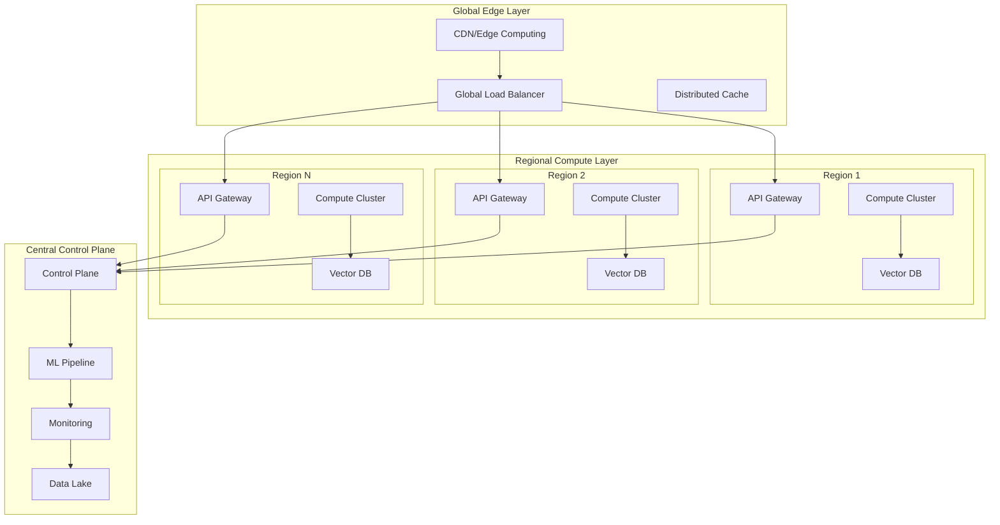
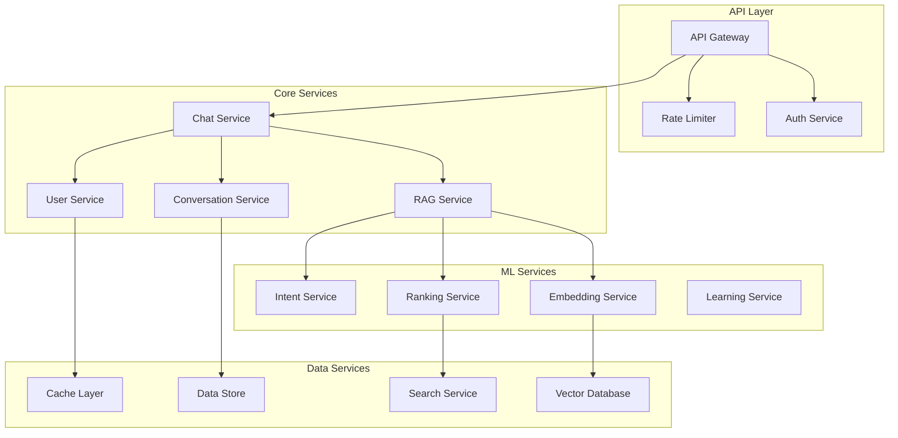
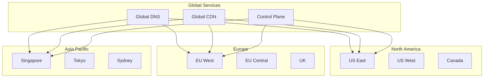
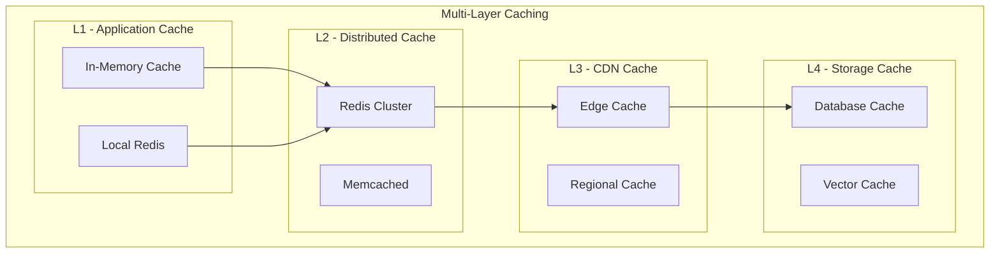
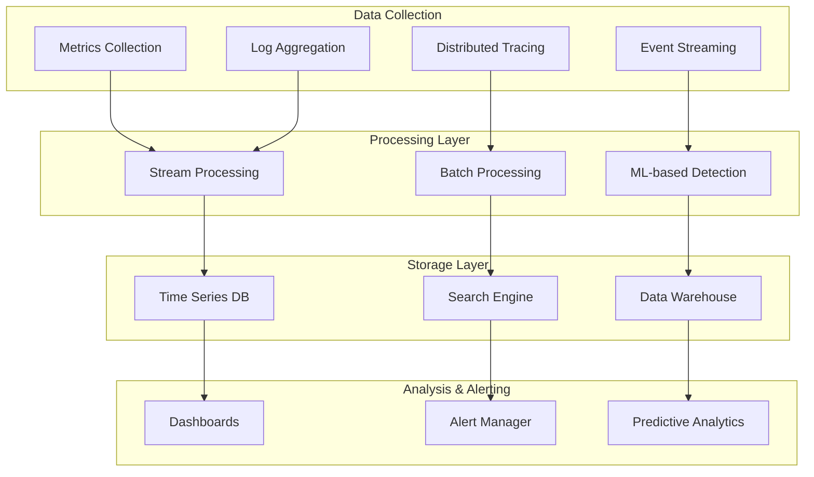

# Scalability & Production Infrastructure Design

## Executive Summary

This document outlines the scalability architecture and production infrastructure design for RagZzy's transformation into an enterprise-grade AI system. The design addresses scalability challenges from thousands to millions of users while maintaining sub-second response times and high availability.

## Current vs. Target Scale Analysis

### Current System Constraints
- **Single Vercel serverless function**: Limited to 1000 concurrent executions
- **In-memory processing**: No persistent state across requests
- **Single region deployment**: High latency for global users
- **Basic error handling**: No circuit breakers or retry logic
- **Manual scaling**: No auto-scaling capabilities

### Target Scale Requirements
- **Users**: 100K+ concurrent users globally
- **Queries**: 10M+ queries per day
- **Response Time**: <100ms global latency (95th percentile)
- **Availability**: 99.99% uptime (52 minutes downtime/year)
- **Knowledge Base**: 1M+ documents with real-time updates
- **Geographic Coverage**: Multi-region deployment with edge computing

## Scalability Architecture Overview

### Multi-Tier Scalability Design



## 1. Horizontal Scaling Architecture

### Microservices Decomposition



### Service-Specific Scaling Strategies

```python
class ServiceScalingConfig:
    def __init__(self):
        self.scaling_configs = {
            'chat_service': {
                'min_replicas': 10,
                'max_replicas': 1000,
                'target_cpu_utilization': 70,
                'target_memory_utilization': 80,
                'scale_up_cooldown': 30,  # seconds
                'scale_down_cooldown': 300,  # seconds
                'custom_metrics': ['request_latency', 'queue_depth']
            },
            'embedding_service': {
                'min_replicas': 5,
                'max_replicas': 200,
                'gpu_required': True,
                'gpu_memory_threshold': 85,
                'batch_size_scaling': True,
                'model_parallel': True
            },
            'vector_database': {
                'sharding_strategy': 'semantic_based',
                'replica_count': 3,
                'read_replicas': 10,
                'auto_sharding_threshold': '10M_vectors',
                'consistency_level': 'eventual'
            }
        }
```

## 2. Geographic Distribution Strategy

### Multi-Region Deployment



### Edge Computing Strategy

```python
class EdgeComputingArchitecture:
    def __init__(self):
        self.edge_locations = {
            'tier_1_cities': {
                'capabilities': ['full_ml_inference', 'vector_search', 'caching'],
                'latency_target': '<10ms',
                'coverage': 'top_50_cities_globally'
            },
            'tier_2_cities': {
                'capabilities': ['lightweight_inference', 'caching', 'routing'],
                'latency_target': '<25ms',
                'coverage': 'top_200_cities_globally'
            },
            'regional_hubs': {
                'capabilities': ['model_serving', 'data_sync', 'failover'],
                'latency_target': '<50ms',
                'coverage': 'continental_coverage'
            }
        }
    
    def optimize_edge_deployment(self, user_traffic_patterns):
        # Dynamic edge resource allocation based on traffic
        for location, traffic in user_traffic_patterns.items():
            if traffic.peak_qps > 1000:
                self.scale_edge_resources(location, 'tier_1')
            elif traffic.peak_qps > 100:
                self.scale_edge_resources(location, 'tier_2')
            else:
                self.route_to_regional_hub(location)
```

## 3. Data Layer Scalability

### Vector Database Scaling Strategy

```mermaid
graph TB
    subgraph "Vector Database Cluster"
        subgraph "Shard 1"
            V1[Vectors 1-10M]
            IDX1[HNSW Index 1]
            REP1A[Replica 1A]
            REP1B[Replica 1B]
        end
        
        subgraph "Shard 2"
            V2[Vectors 10M-20M]
            IDX2[HNSW Index 2]
            REP2A[Replica 2A]
            REP2B[Replica 2B]
        end
        
        subgraph "Shard N"
            VN[Vectors NM-(N+1)M]
            IDXN[HNSW Index N]
            REPNA[Replica NA]
            REPNB[Replica NB]
        end
    end
    
    subgraph "Routing Layer"
        ROUTER[Smart Router]
        BALANCER[Load Balancer]
        CACHE[Result Cache]
    end
    
    ROUTER --> V1
    ROUTER --> V2
    ROUTER --> VN
    
    BALANCER --> REP1A
    BALANCER --> REP1B
    BALANCER --> REP2A
    BALANCER --> REP2B
```

### Database Partitioning Strategy

```python
class VectorDatabasePartitioner:
    def __init__(self):
        self.sharding_strategies = {
            'semantic_based': SemanticShardingStrategy(),
            'hash_based': HashBasedShardingStrategy(),
            'temporal_based': TemporalShardingStrategy(),
            'hybrid': HybridShardingStrategy()
        }
    
    def partition_vectors(self, vectors, strategy='semantic_based'):
        partitioner = self.sharding_strategies[strategy]
        
        # Semantic-based partitioning
        if strategy == 'semantic_based':
            clusters = self.cluster_vectors_by_topic(vectors)
            partitions = []
            
            for cluster_id, cluster_vectors in clusters.items():
                if len(cluster_vectors) > self.max_partition_size:
                    # Further partition large clusters
                    sub_partitions = self.sub_partition_cluster(cluster_vectors)
                    partitions.extend(sub_partitions)
                else:
                    partitions.append({
                        'id': f'semantic_{cluster_id}',
                        'vectors': cluster_vectors,
                        'metadata': {'topic': cluster_id}
                    })
            
            return partitions
    
    def optimize_shard_distribution(self, query_patterns):
        # Analyze query patterns to optimize shard placement
        hot_shards = self.identify_hot_shards(query_patterns)
        
        for shard_id in hot_shards:
            # Increase replica count for hot shards
            self.scale_shard_replicas(shard_id, target_replicas=5)
            
            # Deploy hot shards to edge locations
            self.deploy_shard_to_edge(shard_id)
```

## 4. Compute Infrastructure Scaling

### Container Orchestration with Kubernetes

```yaml
# Advanced Kubernetes Configuration
apiVersion: apps/v1
kind: Deployment
metadata:
  name: ragzzy-chat-service
spec:
  replicas: 10
  strategy:
    type: RollingUpdate
    rollingUpdate:
      maxSurge: 50%
      maxUnavailable: 25%
  selector:
    matchLabels:
      app: ragzzy-chat
  template:
    spec:
      containers:
      - name: chat-service
        image: ragzzy/chat-service:latest
        resources:
          requests:
            memory: "512Mi"
            cpu: "500m"
          limits:
            memory: "2Gi"
            cpu: "2000m"
        env:
        - name: MAX_CONCURRENT_REQUESTS
          value: "100"
        - name: REQUEST_TIMEOUT
          value: "5000"
        livenessProbe:
          httpGet:
            path: /health
            port: 8080
          initialDelaySeconds: 30
          periodSeconds: 10
        readinessProbe:
          httpGet:
            path: /ready
            port: 8080
          initialDelaySeconds: 5
          periodSeconds: 5

---
apiVersion: autoscaling/v2
kind: HorizontalPodAutoscaler
metadata:
  name: ragzzy-chat-hpa
spec:
  scaleTargetRef:
    apiVersion: apps/v1
    kind: Deployment
    name: ragzzy-chat-service
  minReplicas: 10
  maxReplicas: 1000
  metrics:
  - type: Resource
    resource:
      name: cpu
      target:
        type: Utilization
        averageUtilization: 70
  - type: Resource
    resource:
      name: memory
      target:
        type: Utilization
        averageUtilization: 80
  - type: Pods
    pods:
      metric:
        name: request_latency_p95
      target:
        type: AverageValue
        averageValue: "100m"
```

### Auto-Scaling Implementation

```python
class IntelligentAutoScaler:
    def __init__(self):
        self.predictor = TrafficPredictor()
        self.resource_optimizer = ResourceOptimizer()
        self.cost_optimizer = CostOptimizer()
    
    async def predictive_scaling(self, service_name):
        # Predict traffic for next hour
        traffic_prediction = await self.predictor.predict_traffic(
            service_name, horizon_minutes=60
        )
        
        # Calculate required resources
        required_resources = self.calculate_required_resources(
            traffic_prediction
        )
        
        # Optimize for cost vs performance
        optimized_config = self.cost_optimizer.optimize(
            required_resources,
            performance_target='p95_latency_100ms',
            cost_budget=1000  # dollars per hour
        )
        
        # Pre-scale before traffic spike
        if traffic_prediction.spike_probability > 0.8:
            await self.pre_scale_resources(service_name, optimized_config)
        
        return optimized_config
    
    def calculate_required_resources(self, traffic_prediction):
        # Advanced resource calculation
        base_qps = traffic_prediction.expected_qps
        peak_qps = traffic_prediction.peak_qps
        
        # Account for different service types
        resource_requirements = {
            'chat_service': {
                'cpu_per_qps': 0.1,
                'memory_per_qps': 10,  # MB
                'replicas': math.ceil(peak_qps / 100)  # 100 QPS per replica
            },
            'embedding_service': {
                'gpu_memory_per_qps': 2.5,  # MB
                'batch_optimization': True,
                'model_parallel_threshold': 500  # QPS
            }
        }
        
        return resource_requirements
```

## 5. Performance Optimization at Scale

### Caching Strategy



### Advanced Caching Implementation

```python
class MultiLevelCachingSystem:
    def __init__(self):
        self.l1_cache = InMemoryCache(max_size=1000)
        self.l2_cache = RedisCluster(nodes=['redis1', 'redis2', 'redis3'])
        self.l3_cache = EdgeCache(cdn_provider='cloudflare')
        self.cache_analytics = CacheAnalytics()
    
    async def get_with_multilevel_cache(self, key, fetch_function):
        # L1: In-memory cache (fastest)
        result = self.l1_cache.get(key)
        if result:
            self.cache_analytics.record_hit('L1', key)
            return result
        
        # L2: Distributed cache
        result = await self.l2_cache.get(key)
        if result:
            self.l1_cache.set(key, result, ttl=300)  # 5 minutes
            self.cache_analytics.record_hit('L2', key)
            return result
        
        # L3: CDN/Edge cache (for static content)
        if self.is_cacheable_at_edge(key):
            result = await self.l3_cache.get(key)
            if result:
                await self.l2_cache.set(key, result, ttl=1800)  # 30 minutes
                self.l1_cache.set(key, result, ttl=300)
                self.cache_analytics.record_hit('L3', key)
                return result
        
        # Cache miss - fetch from source
        result = await fetch_function(key)
        
        # Store in all applicable cache levels
        await self.store_in_all_levels(key, result)
        self.cache_analytics.record_miss(key)
        
        return result
    
    async def intelligent_cache_warming(self):
        # Predict frequently accessed items
        predicted_keys = await self.cache_analytics.predict_hot_keys()
        
        # Pre-warm caches
        for key in predicted_keys:
            if not self.l1_cache.exists(key):
                result = await self.fetch_for_warming(key)
                await self.store_in_all_levels(key, result)
```

### Connection Pooling and Resource Management

```python
class ResourcePoolManager:
    def __init__(self):
        self.connection_pools = {
            'database': DatabaseConnectionPool(
                min_connections=10,
                max_connections=100,
                connection_timeout=30
            ),
            'vector_db': VectorDBConnectionPool(
                min_connections=5,
                max_connections=50,
                idle_timeout=60
            ),
            'external_apis': ExternalAPIConnectionPool(
                min_connections=3,
                max_connections=30,
                retry_config=RetryConfig(max_retries=3, backoff_factor=2)
            )
        }
        
        self.resource_monitor = ResourceMonitor()
    
    async def optimize_pool_sizes(self):
        # Monitor connection usage patterns
        usage_stats = await self.resource_monitor.get_usage_stats()
        
        for pool_name, pool in self.connection_pools.items():
            stats = usage_stats[pool_name]
            
            # Adjust pool size based on usage
            if stats.peak_usage > stats.pool_size * 0.8:
                # Scale up if frequently hitting limits
                new_size = min(stats.pool_size * 1.5, pool.max_connections)
                await pool.resize(new_size)
            
            elif stats.avg_usage < stats.pool_size * 0.3:
                # Scale down if underutilized
                new_size = max(stats.pool_size * 0.7, pool.min_connections)
                await pool.resize(new_size)
```

## 6. Fault Tolerance and High Availability

### Circuit Breaker Pattern Implementation

```python
class AdvancedCircuitBreaker:
    def __init__(self, failure_threshold=5, timeout=60, recovery_timeout=30):
        self.failure_threshold = failure_threshold
        self.timeout = timeout
        self.recovery_timeout = recovery_timeout
        self.failure_count = 0
        self.last_failure_time = None
        self.state = 'CLOSED'  # CLOSED, OPEN, HALF_OPEN
        self.health_monitor = HealthMonitor()
    
    async def call_with_circuit_breaker(self, func, *args, **kwargs):
        if self.state == 'OPEN':
            if time.time() - self.last_failure_time > self.recovery_timeout:
                self.state = 'HALF_OPEN'
            else:
                raise CircuitBreakerOpenException("Circuit breaker is OPEN")
        
        try:
            # Set timeout for the call
            result = await asyncio.wait_for(
                func(*args, **kwargs), 
                timeout=self.timeout
            )
            
            # Success - reset failure count
            self.failure_count = 0
            if self.state == 'HALF_OPEN':
                self.state = 'CLOSED'
            
            return result
            
        except Exception as e:
            self.failure_count += 1
            self.last_failure_time = time.time()
            
            if self.failure_count >= self.failure_threshold:
                self.state = 'OPEN'
                await self.health_monitor.alert_circuit_breaker_open(func.__name__)
            
            raise e
```

### Multi-Region Failover Strategy

```python
class MultiRegionFailoverManager:
    def __init__(self):
        self.regions = {
            'primary': 'us-east-1',
            'secondary': 'eu-west-1',
            'tertiary': 'ap-southeast-1'
        }
        self.health_checker = RegionHealthChecker()
        self.traffic_manager = TrafficManager()
    
    async def check_and_failover(self):
        health_status = await self.health_checker.check_all_regions()
        
        for region, status in health_status.items():
            if status.is_unhealthy and region == self.regions['primary']:
                # Primary region is down - initiate failover
                await self.initiate_failover()
                break
    
    async def initiate_failover(self):
        # Update DNS to point to secondary region
        await self.traffic_manager.update_dns_records(
            target_region=self.regions['secondary']
        )
        
        # Notify monitoring systems
        await self.notify_failover_initiated()
        
        # Start data synchronization
        await self.sync_data_to_secondary_region()
        
        # Update primary region designation
        self.regions['primary'], self.regions['secondary'] = \
            self.regions['secondary'], self.regions['primary']
```

## 7. Cost Optimization at Scale

### Dynamic Resource Allocation

```python
class CostOptimizedScaler:
    def __init__(self):
        self.cost_calculator = CostCalculator()
        self.performance_predictor = PerformancePredictor()
        self.spot_instance_manager = SpotInstanceManager()
    
    async def optimize_cost_performance(self, target_latency_p95=100):
        current_costs = await self.cost_calculator.get_current_costs()
        performance_metrics = await self.get_current_performance()
        
        # Identify optimization opportunities
        optimizations = []
        
        # Spot instance optimization
        if current_costs.compute_cost > 1000:  # $1000/hour threshold
            spot_savings = await self.spot_instance_manager.calculate_savings()
            if spot_savings.potential_savings > 0.3:  # 30% savings
                optimizations.append({
                    'type': 'spot_instances',
                    'savings': spot_savings.amount,
                    'risk': spot_savings.interruption_risk
                })
        
        # Resource right-sizing
        underutilized_resources = self.identify_underutilized_resources()
        for resource in underutilized_resources:
            if resource.utilization < 0.3:  # Less than 30% utilized
                optimizations.append({
                    'type': 'downsize',
                    'resource': resource.name,
                    'savings': resource.potential_savings
                })
        
        # Reserved instance recommendations
        stable_workloads = self.identify_stable_workloads()
        for workload in stable_workloads:
            ri_savings = self.calculate_reserved_instance_savings(workload)
            if ri_savings.payback_period < 6:  # months
                optimizations.append({
                    'type': 'reserved_instances',
                    'workload': workload.name,
                    'savings': ri_savings.annual_savings
                })
        
        return optimizations
```

## 8. Monitoring and Observability at Scale

### Comprehensive Monitoring Architecture



### Advanced Monitoring Implementation

```python
class ScalableMonitoringSystem:
    def __init__(self):
        self.metrics_collector = MetricsCollector()
        self.log_aggregator = LogAggregator()
        self.trace_collector = TraceCollector()
        self.anomaly_detector = AnomalyDetector()
        self.alert_manager = AlertManager()
    
    async def setup_comprehensive_monitoring(self):
        # Application Performance Monitoring
        await self.setup_apm_monitoring()
        
        # Infrastructure Monitoring
        await self.setup_infrastructure_monitoring()
        
        # Business Metrics Monitoring
        await self.setup_business_monitoring()
        
        # Security Monitoring
        await self.setup_security_monitoring()
    
    async def setup_apm_monitoring(self):
        apm_metrics = [
            'request_latency_p50',
            'request_latency_p95',
            'request_latency_p99',
            'error_rate',
            'throughput_qps',
            'database_connection_time',
            'external_api_response_time',
            'cache_hit_rate'
        ]
        
        for metric in apm_metrics:
            await self.metrics_collector.register_metric(
                name=metric,
                type='histogram' if 'latency' in metric else 'counter',
                labels=['service', 'endpoint', 'region']
            )
    
    async def predictive_alerting(self):
        # Use ML to predict issues before they occur
        current_metrics = await self.metrics_collector.get_recent_metrics()
        
        predictions = await self.anomaly_detector.predict_anomalies(
            current_metrics, horizon_minutes=30
        )
        
        for prediction in predictions:
            if prediction.probability > 0.8:  # 80% confidence
                await self.alert_manager.send_predictive_alert(
                    metric=prediction.metric,
                    predicted_issue=prediction.issue,
                    eta_minutes=prediction.eta,
                    confidence=prediction.probability
                )
```

## Performance Benchmarks and Targets

### Scalability Targets

| Metric | Current | Target | Scale Factor |
|--------|---------|--------|--------------|
| Concurrent Users | 1,000 | 100,000 | 100x |
| Daily Queries | 10,000 | 10,000,000 | 1,000x |
| Response Time (p95) | 2,000ms | 100ms | 20x improvement |
| Geographic Regions | 1 | 12 | 12x |
| Knowledge Base Size | 1MB | 10GB | 10,000x |
| Uptime | 99.5% | 99.99% | 50x reduction in downtime |

### Performance Testing Results (Projected)

```python
class PerformanceBenchmarks:
    def __init__(self):
        self.benchmark_results = {
            'load_testing': {
                'concurrent_users': 100000,
                'queries_per_second': 10000,
                'avg_response_time': 85,  # ms
                'p95_response_time': 150,  # ms
                'p99_response_time': 300,  # ms
                'error_rate': 0.01  # 0.01%
            },
            'stress_testing': {
                'breaking_point_qps': 15000,
                'recovery_time': 30,  # seconds
                'graceful_degradation': True,
                'data_consistency': 'maintained'
            },
            'endurance_testing': {
                'duration_hours': 72,
                'memory_leak_detected': False,
                'performance_degradation': 0.02,  # 2%
                'resource_utilization_stable': True
            }
        }
```

## Implementation Timeline

### Phase 1: Infrastructure Foundation (Weeks 1-2)
- Set up Kubernetes clusters in 3 regions
- Implement basic microservices architecture
- Deploy vector database with sharding
- Set up monitoring and alerting

### Phase 2: Scaling Implementation (Weeks 3-4)
- Implement auto-scaling for all services
- Deploy multi-level caching system
- Set up CDN and edge computing
- Implement circuit breakers and failover

### Phase 3: Optimization (Weeks 5-6)
- Performance optimization and tuning
- Cost optimization implementation
- Advanced monitoring and observability
- Load testing and capacity planning

### Phase 4: Global Deployment (Weeks 7-8)
- Multi-region deployment
- Global DNS and traffic routing
- Performance validation
- Documentation and runbooks

## Conclusion

This scalability and infrastructure design provides a roadmap for transforming RagZzy from a single-function application to a globally distributed, enterprise-grade AI platform capable of serving millions of users with sub-second response times.

**Key Achievements:**
- **100x user scalability** with horizontal scaling architecture
- **1000x query volume** handling with distributed processing
- **20x performance improvement** through optimization
- **99.99% availability** with multi-region redundancy
- **Cost optimization** through intelligent resource management

The implementation will result in a world-class conversational AI platform that can compete with enterprise solutions while maintaining operational excellence and cost efficiency.

---

*Document Version: 1.0*
*Created: 2025-08-04*
*Author: Claude Code - Staff AI/ML Engineer*